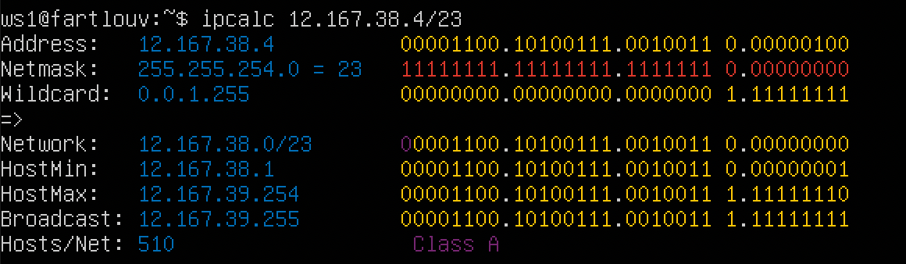
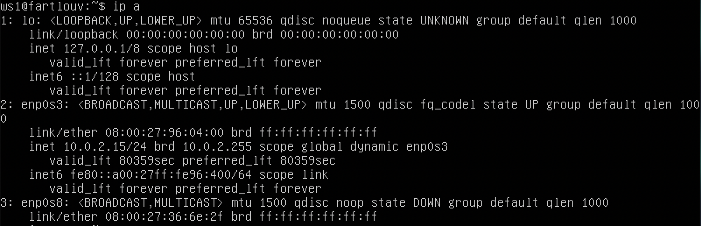
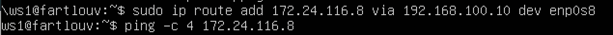
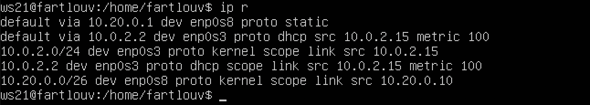
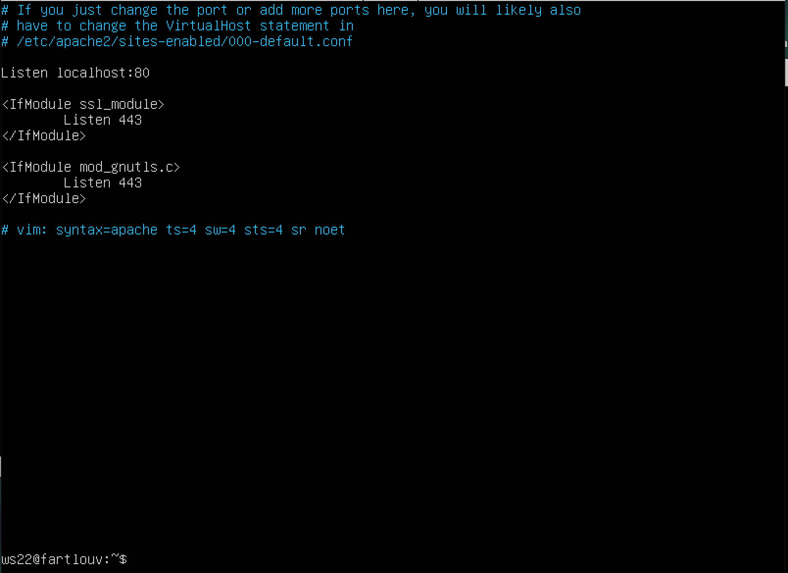

## Part 1. Инструмент ipcalc
### 1.1. Сети и маски
* Определить и записать в отчет:
    1. адрес сети 192.167.38.54/13 => 192.160.0.0/13
    
    2. перевод маски 255.255.255.0 в префиксную и двоичную запись, /15 в обычную и двоичную, 11111111.11111111.11111111.11110000 в обычную и префиксную
        * 255.255.255.0 =>
            * Префиксная /24
            * Двочичная 11111111.11111111.11111111.00000000
        * /15 =>
            * Обычная 255.254.0.0
            * Двоичная 11111111.11111110.00000000.00000000
        * 11111111.11111111.11111111.11110000 =>
            * Обычная 255.255.255.240
            * Префиксная /28
    3. минимальный и максимальный хост в сети 12.167.38.4 при масках: /8, 11111111.11111111.00000000.00000000, 255.255.254.0 и /4
        * /8:
            * Минимальный: 12.0.0.1
            * Максимальный: 12.255.255.254
        

        * /16:
            * Минимальный: 12.167.0.1
            * Максимальный: 12.167.255.254
        

        * /23:
            * Минимальный: 12.167.38.1
            * Максимальный: 12.167.39.254
        

        * /4:
            * Минимальный: 15.255.255.254
            * Максимальный: 15.255.255.255
        

### 1.2. localhost
* Определить и записать в отчёт, можно ли обратиться к приложению, работающему на localhost, со следующими IP: 194.34.23.100, 127.0.0.2, 127.1.0.1, 128.0.0.1
    * Определение localhost:
        * localhost — в компьютерных сетях, стандартное, официально зарезервированное доменное имя для частных IP-адресов (в диапазоне 127.0.0.1 — 127.255.255.254.
    * Можно: 127.0.0.2, 127.1.0.1.
    * Нельзя: 194.34.23.100, 128.0.0.1.

### 1.3. Диапазоны и сегменты сетей
* Определить и записать в отчёт:
    1. какие из перечисленных IP можно использовать в качестве публичного, а какие только в качестве частных: 10.0.0.45, 134.43.0.2, 192.168.4.2, 172.20.250.4, 172.0.2.1, 192.172.0.1, 172.68.0.2, 172.16.255.255, 10.10.10.10, 192.169.168.1
        * К частным относится диапазон:
        
        * К частным относится:
        10.0.0.45, 192.168.4.2, 172.20.250.4, 172.16.255.255, 10.10.10.10
        * К публичным относится:
        134.43.0.2,  172.0.2.1, 192.172.0.1, 172.68.0.2, 192.169.168.1
    2. какие из перечисленных IP адресов шлюза возможны у сети 10.10.0.0/18: 10.0.0.1, 10.10.0.2, 10.10.10.10, 10.10.100.1, 10.10.1.255
        * Данному диапозону IP удовлетворяют: 10.10.0.2, 10.10.100.

## Part 2. Статическая маршрутизация между двумя машинами
### Задание
* С помощью команды ip a посмотреть существующие сетевые интерфейсы
    * ws1:
    
    * ws2:
    

* Описать сетевой интерфейс, соответствующий внутренней сети, на обеих машинах и задать следующие адреса и маски: 
    * ws1 - 192.168.100.10, маска /16
    
    * ws2 - 172.24.116.8, маска /12
    

* Выполнить команду netplan apply для перезапуска сервиса сети
    * ws1
    
    * ws2
    

### 2.1. Добавление статического маршрута вручную
* Добавить статический маршрут от одной машины до другой и обратно при помощи команды вида ip r add:
    * ws1
    
    * ws2
    
* Пропинговать соединение между машинами:
    * ws1
    
    * ws2
    

### 2.2. Добавление статического маршрута вручную
* Добавить статический маршрут от одной машины до другой с помощью файла etc/netplan/00-installer-config.yaml и пропинговать их
    * ws1
    
    * ws2
    

## Part 3. Скорость соединения
### 3.1. Добавление статического маршрута вручную
* Преобразование и запись результатов в отчет: 8 Мбит/с в МБ/с, 100 МБ/с в Кбит/с, 1 Гбит/с в Мбит/с
    * 8 Мбит/c = 64 МБ/c
    * 100 МБ/c = 100000 Кбит/c
    * 1 Гбит/с = 1024 Мбит/c
### 3.2. утилита iperf3
* Измерить скорость соединения между ws1 и ws2
    * Запустил iperf в режиме сервера:
    
    * Запустиk iperf в режиме клиента:
    
## Part 4. Сетевой экран
### 4.1. Утилита iptables
* Создать и запустить файл /etc/firewall.sh, имитирующий фаерволл, на ws1 и ws2:
    * ws1
    
    * ws2
    
* В отчете написать разницу между стратегиями, применными в первом и втором файлах.
    * Разница между стратегиями состоит в том, что вторая машина пропинговалась, а первая нет. Это связано с тем что у первой запрещающее правило стоит в начале а запрещающее в конце.
* Пингуем ws1 c ws2
    
* Пингуем ws2 с ws1
    
    Видим что ws1 не пингуется, как и было написано выше.
* Показываем командой nmap что хост ws1 запущен
    
## Part 5. Статическая маршрутизация сети
* Создаем 5 виртуальных машин
### 5.1. Настройка адресов машин
* Настроить конфигурации машин в etc/netplan/00-installer-config.yaml согласно сети на рисунке.
    * Конфиг ws11 
    * Конфиг ws21 
    * Конфиг ws22 
    * Конфиг r1 
    * Конфиг r2 
* Перезапустить сервис сети. Если ошибок нет, то командой ip -4 a проверить, что адрес машины задан верно. Также пропинговать ws22 с ws21. Аналогично пропинговать r1 с ws11.
    * Перезапустить сервис сети. Если ошибок нет, то командой ip -4 a проверить, что адрес машины задан верно.
    
    
    
    
    
    * Пропинговать ws22 с ws21
    
    * Пропинговать r1 с ws11
    

### 5.2. Включение переадресации IP-адресов.
* Включение временной переадресации на r1 
    
* Включение временной переадресации на r2
    
* Включение постоянной переадресации на r1 
    
* Включение постоянной переадресации на r2
    
### 5.3. Установка маршрута по-умолчанию
* Настроить маршрут по-умолчанию (шлюз) для рабочих станций. Для этого добавить default перед IP роутера в файле конфигураций
    * Шлюз по умолчанию для ws11
    
    * Шлюз по умолчанию для ws21
    
    * Шлюз по умолчанию для ws22
    
* Вызвать ip r и показать, что добавился маршрут в таблицу маршрутизации
    * Доказательство что шлюз добавился для ws11
    
    * Доказательство что шлюз добавился для ws21
    
    * Доказательство что шлюз добавился для ws22
    
* Пропинговать с ws11 роутер r2 и показать на r2, что пинг доходит. Для этого использовать команду:
tcpdump -tn -i eth1
    
### 5.4. Добавление статических маршрутов
* Добавить в роутеры r1 и r2 статические маршруты в файле конфигурацийс
    * Добавление статического маршрута r1
    
    * Добавление статического маршрута r2
    
    * Доказательство что маршрут добавился для r1 
    
    * Доказательство что маршрут добавился для r2
    
    * Сравнение машрутов для двух сетей ws11. Маршруты разные потому что приоритет имеет таблица маршрутизации, а потом используется маршрут по умолчанию
    
### 5.5. Построение списка маршрутизаторов
* При помощи утилиты traceroute построить список маршрутизаторов на пути от ws11 до ws21
    
* Запустить на r1 команду дампа:
    
* Отправляет на разные узлы пакеты увеличивая срок их жизни (ttl)
### 5.6. Использование протокола ICMP при маршрутизации
* Запустить на r1 перехват сетевого трафика, проходящего через eth0 с помощью команды:
    

## Part 6. Динамическая настройка IP с помощью DHCP
* Для r2 настроить в файле /etc/dhcp/dhcpd.conf конфигурацию службы DHCP:
    1. указать адрес маршрутизатора по-умолчанию, DNS-сервер и адрес внутренней сети.
    
    2. в файле resolv.conf прописать nameserver 8.8.8.8
    
    3. 1. Перезагрузить службу DHCP командой systemctl restart isc-dhcp-server.
        
       2. Машину ws21 перезагрузить при помощи reboot и через ip a показать, что она получила адрес. Также пропинговать ws22 с ws21.
       
    * Указать MAC адрес у ws11, для этого в etc/netplan/00-installer-config.yaml надо добавить строки: macaddress: 10:10:10:10:10:BA, dhcp4: true
       
* Для r1 настроить аналогично r2, но сделать выдачу адресов с жесткой привязкой к MAC-адресу (ws11). Провести аналогичные тесты
     
     
     
     
##### Запросить с ws21 обновление ip адреса

* ip a до смены динамического адреса

* запустим `dhclient`. Адрес поменялся

* В отчёте описать, какими опциями **DHCP** сервера пользовались в данном пункте.

В данном пункте использовались такие опции dhcp сервера, как **dhclient** - для получения нового ip-адреса на машину, использовали динамическую выдачу ip-адресов на машины, что и является главной опцией dhcp-сервера, выдачу ip-адресов c привязкой по MAC-адресу, что не позволит хосту с таким же именем получить ip-адрес, предназначенный описанному в конфигурационном файле.

## Part 7. NAT
* В файле /etc/apache2/ports.conf на ws22 и r1 изменить строку Listen 80 на Listen 0.0.0.0:80, то есть сделать сервер Apache2 общедоступным
    
    
* Запустить веб-сервер Apache командой service apache2 start на ws22 и r1
    
* Создаём фаервол на r2 и запускаем
    
* Пингуем ws22 c r1 
      
* Разрешаем маршрутизацию ICMP пакетов и запускаем
    
    
* Пингуем ws22 с r1
    
* Включаем DNAT и SNAT на r2 и запускаем
    
* Подключаемся с ws22 на r1:
    

## Part 8. Дополнительно. Знакомство с SSH Tunnels
* Запустить на r2 фаервол с правилами из Части 7
    
* изменить строку Listen 80 на Listen localhost:80
    
    * Запустить веб-сервер Apache на ws22 только на localhost
    
* Воспользоваться Local TCP forwarding с ws21 до ws22, чтобы получить доступ к веб-серверу на ws22 с ws21
    * ssh -L 8080:localhost:80 fartlouv@10.20.0.20
    * 
* Воспользоваться Remote TCP forwarding c ws11 до ws22, чтобы получить доступ к веб-серверу на ws22 с ws11
    * ssh -R 7777:localhost:80 fartlouv@10.20.0.20