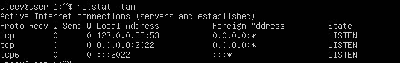
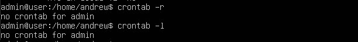

## Part 1. Установка ОС
#### Выполнение команды cat /etc/issue

## Part 2. Создание пользователя
#### Создание пользователя

- Добавление пользователя в группу - sudo usermod -aG adm gibon.
#### Выполнение команды cat /etc/passwd

## Part 3. Настройка сети ОС
#### Установка названия машины вида user-1

#### Установка временной зоны

#### Вывод названия сетевых интерфейсов

- Loopback обеспечивает связь между компьютерами через специальное ПО без применения дополнительного оборудования. В частности, трафик, отправляемый программой, отображается на интерфейсе. К тому же, для IP тоже используется технология loopback интерфейса. Нам нужен интерфейс lo, чтобы виртуальная машина могла взаимодействовать с реальным протоколом динамической конфигурации хоста (DHCP)

#### Получение IP адреса устройства от DHCP сервера

- DHCP служит для назначения IP-адреса клиенту. Это следует из его названия — Dynamic Host Configuration Protocol. IP-адрес можно назначать вручную каждому клиенту, то есть компьютеру в локальной сети. Но в больших сетях это очень трудозатратно, к тому же, чем больше локальная сеть, тем выше возрастает вероятность ошибки при настройке. Поэтому для автоматизации назначения IP был создан протокол DHCP.

#### IP-адрес внутреннего шлюза

#### IP-адрес внешнего шлюза

#### Установка статичных настроек IP, gw, dns

- Изменение IP, gw, dns:
sudo vim /etc/netplan/00-installer-config.yaml
- С помощью netplan задаем статичные настройки: addresses - ip-адрес, gateway4 - ip-адрес внутреннего шлюза, nameservers - dns сервера.
**Перезагрузка ВМ.**
#### Пинг 1.1.1.1

#### Пинг ya.ru

## Part 4. Обновление ОС

- dist-upgrade - расширенная версия команды apt-upgrade. Помимо обновления существующих пакетов программного обеспечения, он устанавливает и удаляет некоторые пакеты для удовлетворения некоторых зависимостей. Команда включает функцию интеллектуального разрешения конфликтов, что гарантирует, что критически важные пакеты обновляются первыми за счет тех, которые считаются имеющими более низкий приоритет.
## Part 5. Использование команды sudo

- sudo позволяет разрешенному пользователю выполнять команду в качестве суперпользователя или другого пользователя, как указано в политике безопасности.
## Part 6. Установка и настройка службы времени
#### Вывод текущего времени

#### Вывод команды синхронизации

## Part 7. Установка и использование текстовых редакторов
#### Создание файла с помощью Vim

- Для выхода из Vim с сохранением изменений нужно нажать esc,  затем  ввести  ":wq"

#### Создание файла с помощью Nano

- Для выхода из Nano с сохранением изменений нужно нажать Ctrl+S, затем Ctrl+X.

#### Создание файла с помощью  MCEDIT

- Для выхода из MCEDIT с сохранением изменений нужно нажать Esc, затем Yes.

#### Редактирование файла с помощью Vim

- Для выхода из Vim без сохранения изменений нужно нажать esc,  затем  ввести  ":q!"

#### Редактирование файла с помощью Nano

- Для выхода из Nano без сохранения изменений нужно ввести Ctrl + X, затем «n» для выхода без сохранения.

#### Редактирование файла с помощью MCEDIT

- Для выхода из MCEDIT без сохранения изменений нужно  ввести  Esc, затем «No» для выхода без сохранения.

#### Поиск шаблона с помощью Vim

- Не редактируя файл, вводим /(слово для поиска)
#### Поиск и замена шаблона с помощью Vim

- Не редактируя файл, вводим :%s/(слово для поиска)/(слово для замены)/g
#### Поиск шаблона с помощью Nano

- Поиск шаблона осуществляется с помощью сочетания клавиш Ctrl + W
#### Поиск и замена шаблона с помощью Nano

- Поиск шаблона для замены происходит с помощью команды control + , вводим шаблон для поиска, вводим шаблон для замены, выбираем yes при замене буфера
#### Поиск шаблона с помощью MCEDIT

- Поиск шаблона для замены происходит с помощью команды Control+K+F, переходим в начало файла, вводим шаблон для поиска, нажимаем Enter.

#### Поиск и замена шаблона с помощью MCEDIT

- Поиск шаблона для замены происходит с помощью команды F4, переходим в начало файла, вводим шаблон для поиска, затем вводим шаблон для замены, нажимаем "Y"для подтверждения.

## Part 8. Установка и базовая настройка сервиса SSHD
- Установка SSHD: sudo apt install openssh-server.
- Добавление автостарта службы при загрузке системы: sudo systemctl enable ssh.

#### Перенастройка службы SSHd на порт 2022 через Vim с изменением файла

- sudo vim /etc/ssh/sshd_config

#### Наличие процесса sshd с помощью команды ps

#### Используем команду ps, которая показывает состояние процессов
- флаг -F выводит максимально доступные данные процессов
- флаг -С выбирает процессы по имени команды
- UID - пользователь, от имени которого запущен процесс
- PID - инденфикатор процесса
- PPID - индентификатор родительского процесса
- C - процент времени CPU, используемое процессом
- SZ - размера процесса в памяти
- RSS - реальный размер процесса в памяти
- PSR - ядро процессора, на котором выполняется процесс
- STIME - время запуска процесса
- TTY - терминал, из которого запущен процесс
- TIME - общее время процессора, затраченного на выполнение процесса
- CMD - команда запуска процесса

#### Вывод команды netstat -tan

- -Клавиша t - подключение по протоколу TCP
- -a - показывает все подключения
- -n - показывает сетевые адреса как числа
- Proto - протокол используемый сокетом
- Recv-Q - количество байтов не переданных пользователем
- Send-Q - количество байтов не подтвержденных удаленным хостом
- Local Address - локальный адрес и номер порта локальной сети
- Foreign Address - локальный адрес и номер порта удаленной сети
- State - состояние сокета
- 0.0.0.0 обозначает, что никто не подключен к сети.
## Part 9. Установка и использование утилит top, htop
#### Вывод утилиты top

- uptime - локальное время и время прошедшее с последней перезагрузки - 1 мин 38 сек.
- количество авторизованных пользователей - 1 user
- общая загрузка системы - за последние 1 мин, 5 мин, 15 мин
- общее количество процессов - 103
- загрузка cpu - процент времени процессора, затраченного на выполнение процессов, в том числе:
- us - пользовательские процессы (высокое значение данного показателя может указывать, в том числе, на ошибки в коде сайта, необходимость его оптимизации);
- sy - процессы ядра;
- id - неиспользуемые ресурсы (чем выше этот показатель, тем лучше);
- wa - операции ввода/вывода, т.е. дисковые операции.
- Mem, Swap - сведения об использовании оперативной памяти (total - общий объем, free - объем свободной памяти, used - объем использованной памяти).

#### Клавиша M - сортировка по используемой памяти

#### Клавиша T - сортировка по времени работы процесса

#### Утилита htop
**Для сортировки нажимаем F6 и выбираем нужный параметр**
#### Cортировка по PID

#### Cортировка по PERCENT_CPU

#### Cортировка по PERCENT_MEM

#### Cортировка по TIME

## Part 10. Использование утилиты fdisk
#### Запуск команды fdisk -l

- Название: /dev/sda
- Размер: 10,2 GiB
- Кол-во секторов: 21390950

#### Размер swap

## Part 11. Использование утилиты df

#### Запуск команды df

- Размер раздела: 8614052 кб
- Размер занятого пространства: 4440496 кб
- Размер свободного пространства: 3714396 кб
- Процент использования: 55%
- Единица измерения: кб - 1024 байта
#### Запуск команды df -Th

- Размер раздела: 8.3 гб
- Размер занятого пространства: 4.3 гб
- Размер свободного пространства: 3.6 гб
- Процент использования: 55%
- Тип файловой системы: ext4
## Part 12. Использование утилиты du
#### Запуск команды du

#### Вывод размера папок

- -s флаг выводит общий размер
- -h флаг выводит размер в удобном виде для человеческого глаза

#### Вывод содержимого /var/log

## Part 13. Установка и использование утилиты ncdu
- Установка утилиты - sudo apt install ncdu

#### Вывод размера папки /home]

#### Вывод размера папки /var

#### Вывод размера папки /var/log

## Part 14. Работа с системными журналами
#### Vim /var/log/dmesg

#### Vim /var/log/syslog

#### Vim /var/log/auth.log

#### Последняя успешная авторизация

- Найдена с помощью команды cat /var/log/auth.log | grep systemd-logind 
#### Перезапуск службы SSHd: sudo systemctl restart ssh.service

#### Отчёт о рестарте службы в логах

## Part 15. Использование планировщика заданий CRON

#### Изменение планировщика для вывода uptime каждые 2 минуты

#### Вывод текущих задач для CRON

#### Вывод выполнения текущих задач для CRON

#### Удаление и вывод текущих задач

